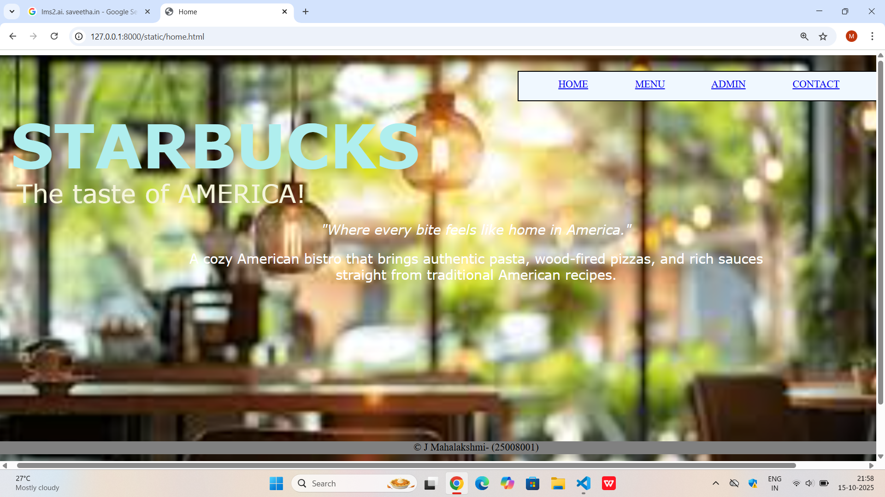

# Ex.07 Restaurant Website
## Date:15.10.2025

## AIM:
To develop a static Restaurant website to display the food items and services provided by them.

## DESIGN STEPS:

### Step 1:
Requirement collection.

### Step 2:
Creating the layout using HTML and CSS.

### Step 3:
Updating the sample content.

### Step 4:
Choose the appropriate style and color scheme.

### Step 5:
Validate the layout in various browsers.

### Step 6:
Validate the HTML code.

### Step 7:
Publish the website in the given URL.

## PROGRAM:

```
home.html
<html>
    <head>
        <title>Home</title>
        <link rel="stylesheet" href="style1.css">
    </head>
    <body>
        <div class="background">
        <div class="contents">
            <a href="home.html">HOME</a>
            <a href="menu.html">MENU</a>
            <a href="admin.html">ADMIN</a>
            <a href="contact.html">CONTACT</a>
        </div>
        <div class="restname">
            <h1><b>STARBUCKS</b></h1>
        </div >
        <div class="line">
            The taste of AMERICA!
        </div>
        <div class="lines">
            <i>"Where every bite feels like home in America."</i>
            <p>A cozy American bistro that brings authentic pasta, wood-fired pizzas, and rich sauces<br> straight from traditional American recipes.</p>
        </div>
        
        <footer class="copyrights">
            &copy; J Mahalakshmi- (25008001)
        </footer>
        </div>
    </body>
</html>
style1.css
.background {
    width: 1470px;
    height: 680px;
    color:black;
    margin-left: auto;
    margin-right: auto;
    padding: 20px;
    font-family:'Times New Roman', Times, serif;
    background-image: url(backrground1.png);
    background-size: cover;
}

.contents {
    width: 550px;
    height: 25px;
    border: 2px solid black;
    padding: 10px;
    background-color: aliceblue;
    text-align: center;
    top: 5px;
    left: 800px;
    position: relative;
    word-spacing: 70px;
}

.restname {
    color: paleturquoise;
    font-family: Verdana;
    text-align: left;
    position: relative;
    font-size: 300%;
    top: -50px;
}

.line {
    color: beige;
    font-family: Verdana;
    text-align: left;
    position: relative;
    font-size: 250%;
    top: -120px;
    left: 10px;
}

.lines {
    color: white;
    font-family: Verdana;
    text-align: center;
    position: relative;
    font-size: 130%;
    top: -100px;
}


.copyrights{
    width: 1510px;
    height: 20px;
    background-color: gray;
    text-align: center;
    left: -20px;
    bottom:-130px;
    position: relative;
}
menu.html
<html>
    <head>
        <title>Home</title>
        <link rel="stylesheet" href="style2.css">
    </head>
    <body>
        <div class="background">
        <div class="contents">
            <a href="home.html">HOME</a>
            <a href="menu.html">MENU</a>
            <a href="admin.html">ADMIN</a>
            <a href="contact.html">CONTACT</a>
        </div>
        <div class="menu">
            <h1><b>MENU</b></h1>
        </div >
        <div class="menugrid">
            <div class="menuitem">
                
                <h1>Pizza</h1>
                <p>Rs. 190</p>
            </div>
            <div class="menuitem">
                
                <h1>Pasta</h1>
                <p>Rs. 180</p>
            </div>
            <div class="menuitem">
                
                <h1>Pastries</h1>
                <p>Rs. 200</p>
            </div>
            <div class="menuitem">
                
                <h1>Hotdog</h1>
                <p>Rs. 220</p>
            </div>
            <div class="menuitem">
                
                <h1>Ice cream</h1>
                <p>Rs. 170</p>
            </div>
            <div class="menuitem">
                
                <h1>Cappucino</h1>
                <p>Rs. 210</p>
            </div>
            <div class="menuitem">
                
                <h1>Burger</h1>
                <p>Rs. 150</p>
            </div>
        </div>
        <footer class="copyrights">
            &copy; J Mahalakshmi (25008001)
        </footer>
        </div>
    </body>
</html>
style2.css
.background {
    width: 1470px;
    height: 680px;
    color:black;
    margin-left: auto;
    margin-right: auto;
    padding: 20px;
    font-family:'Times New Roman', Times, serif;
    background-image: url(background2.png);
    background-size: cover;
}

.contents {
    width: 550px;
    height: 25px;
    border: 2px solid black;
    padding: 10px;
    background-color: aliceblue;
    text-align: center;
    top: 5px;
    left: 900px;
    position: relative;
    word-spacing: 70px;
}

.menu {
    color: paleturquoise;
    font-family: Verdana;
    text-align: left;
    position: relative;
    font-size: 300%;
    top: -50px;
}

.menugrid {
    display: grid;
    grid-template-columns: repeat(auto-fit, minmax(90px, 1fr));;
    gap: 50px;
    justify-items: center;
    padding: 20px;
    margin-top: -50px;
}

.menuitem {
    background-color: beige;
    border-radius: 10px;
    text-align: center;
    padding: 20px;
    width: 100%;
}

.menuitem img {
    border-radius: 10px;
    width: 100%;
    height: 180px;
    object-fit: cover;
}

.menuitem h1 {
    font-size: 1.5em;
    color: black;
    margin-top: 15px;
}

.menuitem p {
    color: black;
    margin-bottom: 0px;
}

.copyrights{
    width: 1510px;
    height: 20px;
    background-color: gray;
    text-align: center;
    top: 100px;
    left: -20px;
    position: relative;
}
admin.html
<html>
    <head>
        <title>Home</title>
        <link rel="stylesheet" href="style3.css">
    </head>
    <body>
        <div class="background">
        <div class="contents">
            <a href="home.html">HOME</a>
            <a href="menu.html">MENU</a>
            <a href="admin.html">ADMIN</a>
            <a href="contact.html">CONTACT</a>
        </div>
        <div class="admin">
            <h1><b>ADMINISTRATION TEAM</b></h1>
        </div>
        <div class="admingrid">
            <div class="adminlist">
                
                <h1>J Mahalakshmi</h1>
                <p class="post">CEO</p>
            </div>
            <div class="adminlist">
                
                <h1>Vijay</h1>
                <p class="post">Marketing Manager</p>
            </div>
            <div class="adminlist">
                
                <h1>Simran</h1>
                <p class="post">Operations Manager</p>
            </div>
            <div class="adminlist">
                
                <h1>Dhoni</h1>
                <p class="post">HR Manager</p>
            </div>
            <div class="adminlist">
                
                <h1>Saipallavi</h1>
                <p class="post">Executive Chef</p>
            </div>
            <div class="adminlist">
                
                <h1>Surya</h1>
                <p class="post">Customer Service Manager</p>
            </div>
        </div>
        <footer class="copyrights">
            &copy; J Mahalakshmi - (25008001)
        </footer>
        </div>
    </body>
</html>
style3.css
.background {
    width: 1470px;
    height: 680px;
    color:black;
    margin-left: auto;
    margin-right: auto;
    padding: 20px;
    font-family:'Times New Roman', Times, serif;
    background-image:url(backrground1.png);
    background-size: cover;
}

.contents {
    width: 550px;
    height: 25px;
    border: 2px solid black;
    padding: 10px;
    background-color: aliceblue;
    text-align: center;
    top: 5px;
    left: 900px;
    position: relative;
    word-spacing: 70px;
}

.admin {
    color: paleturquoise;
    font-family: Verdana;
    text-align: left;
    position: relative;
    font-size: 300%;
    top: -50px;
}

.admingrid {
    display: grid;
    grid-template-columns: repeat(auto-fit, minmax(90px, 1fr));;
    gap: 50px;
    justify-items: center;
    padding: 20px;
    margin-top: -50px;
}

.adminlist{
    background-color: beige;
    border-radius: 10px;
    text-align: center;
    padding: 20px;
    width: 100%;
}

.adminlist img {
    border-radius: 10px;
    width: 100%;
    height: 250px;
    object-fit: cover;
    border-radius: 50% / 35%;
}

.adminlist h1 {
    font-size: 1.5em;
    color: black;
    margin-top: 15px;
}

.adminlist p {
    color: black;
    margin-bottom: 0px;
}

.copyrights {
    width: 1510px;
    height: 20px;
    background-color: gray;
    text-align: center;
    top: 30px;
    left: -20px;
    position: relative;
}
contact.html
<html>
    <head>
        <title>Home</title>
        <link rel="stylesheet" href="style4.css">
    </head>
    <body>
        <div class="background">
        <div class="contents">
            <a href="home.html">HOME</a>
            <a href="menu.html">MENU</a>
            <a href="admin.html">ADMIN</a>
            <a href="contact.html">CONTACT</a>
        </div>
        <div class="contact">
            <h1><b>CONTACT</b></h1>
        </div>
        <div class="info">
            <h1>Visit us at:</h1>
            <p>Starbucks<br>188, Washington Street,<br>Beachside Street, CA 280957<br>United America</p>
            <br>
            <h1>Phone:</h1>
            <p>+91 7865902340</p>
            <br>
            <h1>Email ID:</h1>
            <p>starbucks783@gmail.com</p>
        </div>
        <footer class="copyrights">
            &copy; J Mahalakshmi - (25008001)
        </footer>
        </div>
    </body>
</html>
style4.css
.background {
    width: 1470px;
    height: 680px;
    color:black;
    margin-left: auto;
    margin-right: auto;
    padding: 20px;
    font-family:'Times New Roman', Times, serif;
    background-image: url(background2.png);
    background-size: cover;
}

.contents {
    width: 550px;
    height: 25px;
    border: 2px solid black;
    padding: 10px;
    background-color: aliceblue;
    text-align: center;
    top: 5px;
    left: 900px;
    position: relative;
    word-spacing: 70px;
}

.contact {
    color: paleturquoise;
    font-family: Verdana;
    text-align: left;
    position: relative;
    font-size: 300%;
    top: -50px;
}

.info {
    color: whitesmoke;
    font-family: Times New Roman;
    position: relative;
    top: -70px;
    left: 50;
}

.copyrights{
    width: 1510px;
    height: 20px;
    background-color: gray;
    text-align: center;
    bottom:-130px;
    top:70px;
    left: -20px;
    position: relative;
}
```


## OUTPUT:
    


## RESULT:
The program for designing software company website using HTML and CSS is completed successfully.
